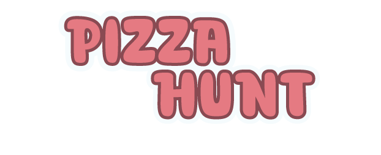

# PIZZA HUNT  ## [Play the Game!](https://david-carballo.github.io/pizza-hunt-game/)

# Descripción del juego

Pizza Hunt es un juego de navegador desarrollado con HTML, CSS y JavaScript, en el que el jugador debe colocar correctamente los ingredientes que caen sobre una pizza. El objetivo es completar las pizzas sin cometer errores, acumulando la máxima puntuación posible. Se pierden vidas al colocar ingredientes en los lugares incorrectos, dejar que tu ingrediente caiga al suelo o hacer pizzas que no cumplen con las expectativas. ¡Pon a prueba tu habilidad y reflejos en este desafío culinario!

# Funcionalidades Principales

- Los ingredientes se mueven mientras caen de izquierda a derecha pulsando `A` y `D` respectivamente.
- Puedes aumentar la velocidad de caída del ingrediente pulsando `W`.
- Coloca un ingrediente en la pizza al pulsar `SPACE`
- Cada pizza tiene un tiempo máximo para colocar los ingredientes, date prisa!
- La dificultad del juego se incrementa cada vez que completas una pizza. Más ingredientes a colocar, y caen con mayor gravedad.
- La puntuación aumenta según lo bien que coloques un ingrediente y lo rápido que hagas la pizza.
- El lugar de colocación de los ingredientes está diseñado para que aparezca uno en el centro y el resto alrededor formando un círculo.

# Funcionalidades Extra

- Animación de entrada y salida de las pizzas.
- Animación del chef cada vez que colocas un nuevo ingrediente.
- Sonido general y efectos de sonido para cada interacción en el juego.
- Botón para silenciar el sonido general.
- Posibilidad de firmar tu pizza con salsa.
- Diseño de todos los ingredientes e interfaz.
- Ranking local al finalizar tu partida con nombre y puntuación.
- Añadir la posibilidad de hacer la pantalla completa.

# Tecnologías usadas

- HTML
- CSS
- CSS Animations
- JavaScript
- DOM Manipulation
- JS Classes
- JS Canvas
- Local Storage
- JS Audio()

# Pantallas

## Pantalla de inicio
</img>
## Pantalla de juego
</img>
## Pantalla final
</img>

# Estructura del proyecto

### [index.html](index.html)
Estructura HTML del juego

### [style.css](styles/style.css)
Estilos y animaciones del juego

### [main.js](js/main.js)
Contiene toda la lógica del juego, DOM Manipulation y controla todos los eventos que ocurren.

### [pizza.js](js/pizza.js)

Clase Pizza contiene todos los atributos y métodos de la pizza: tiempo total para prepararla, puntuación de la pizza, lista de ingredientes...

### [slot-ingredient.js](js/slot-ingredient.js)

Clase SlotIngredient contiene los atributos y métodos del lugar donde colocar el ingrediente.

### [ingredient.js](js/ingredient.js)

Clase Ingredient contiene los atributos y métodos que permiten mover el ingrediente, modificar la velocidad de movimiento y caída, etc.

# Extra Links 

### [Sketch](https://excalidraw.com/#json=tdL9epACcaTdBw-_vJRle,lhbTvQDijF3l5X6kIrDgaA)

### [Slides](https://docs.google.com/presentation/d/1ZgA6PL4nmm79Ua8FhXcfe5Rs7zDKFidkSSkIVHIyqFw/edit?usp=sharing)

### [Deploy](https://david-carballo.github.io/pizza-hunt-game/)
